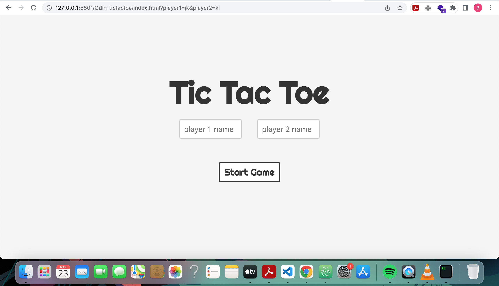
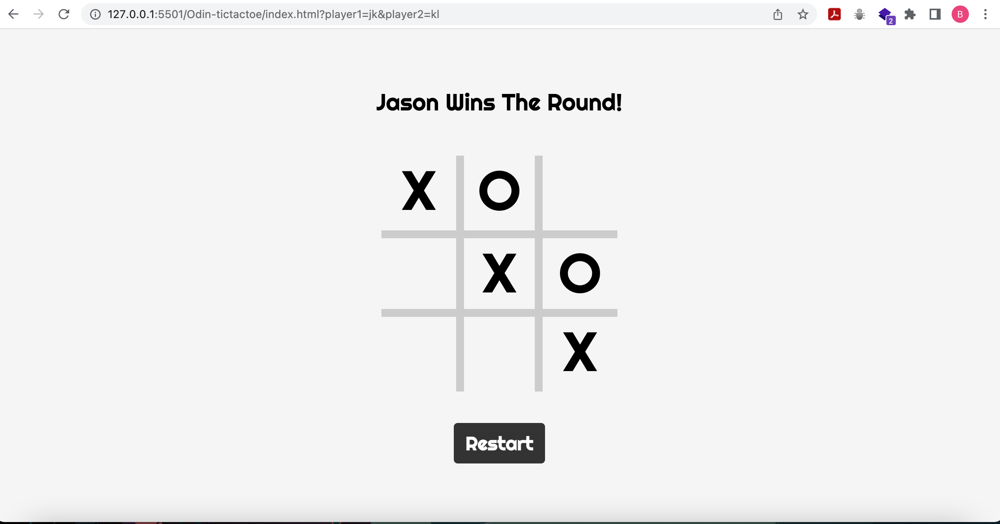

# TIC TAC TOE

This is a Tic Tac Toe game build with module patterns and factory functions.
The game can be played by two players, with one being X and the other being O.

## How to play

The game is played on a 3x3 grid. Each player takes turns to place their symbol (X or O) on the grid by clicking on an empty cell. The first player to get three symbols in a row (horizontally, vertically, or diagonally) wins the game. If all cells are filled and no player has won, the game ends in a draw.

You can play live [here](https://bismarkagyare.github.io/Odin-TicTacToe/): 

## Installation

Clone the repo to your local machine
git clone https://github.com/bismarkagyare/Odin-TicTacToe.git

## Challenges faced

One of the main challenges faced during the development of this game was implementing the logic to check for a win or draw. It required careful consideration of all the possible winning combinations and making sure that the game would correctly identify when a player had won or if the game ended in a draw.

Another challenge was figuring out the best way to structure the code using module patterns and factory functions. It required some experimentation and refactoring to come up with a clean and maintainable code structure.

## What I learned

Through building this Tic Tac Toe game, I learned the importance of careful planning and design before diving into implementation. It's also crucial to break down complex problems into smaller, more manageable pieces to avoid getting overwhelmed.

I also gained a better understanding of the benefits of using module patterns and factory functions for organizing code. By separating the different components of the game into modules and creating factory functions to generate game objects, the code became more modular and easier to maintain.

## Future Improvements

There are several ways to improve this game. In the future, i plan to add a scoreboard to keep track of wins and losses, implement an AI player to play against and some cool animations to make the visuals more appealing.

## Built With

## Credits

This game was built by Bismark Agyare as part of [The Odin Project](https://www.theodinproject.com/lessons/node-path-javascript-tic-tac-toe). If you have any feedback or suggestions for improvement, feel free to contact me at bismarkagyare54@gmail.com